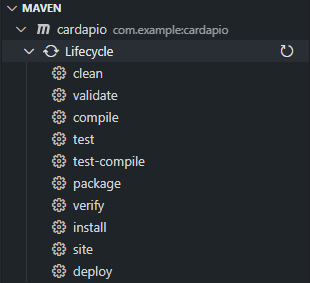

<h1>Projeto Cardápio Digital - Backend</h1>

<a href="#Project">Projeto</a> •
  <a href="#tools">Ferramentas Necessárias</a> •
  <a href="#minhas-redes">Minhas redes</a> 

**Isso é um projeto de estudo, feito com a [Fernanda Kipper](https://github.com/Fernanda-Kipper) no qual está presente em seu canal do Youtube todo o processo.**

<h2 id = "Project">O Projeto</h2>

Essa aplicação foi desenvolvido durante o vídeo [Construindo aplicação Fullstack do ZERO](https://www.youtube.com/@kipperdev) utilizando **Java Spring e Spring MVC** para criação do servidor, **Spring Data JPA** para manipulação e persistência de dados, **Lombok** para geração de boilerplates e Postgres Driver para realizar a conexão com banco de dados Postgress.

<h2 id = "tools" >💻 Ferramentas Necessárias</h2>

Dentro do Vscode, vamos instalar as dependencias com o Maven:

  

#### Instale o 'package'

<h2 id = "Minhas-redes">Minhas Redes</h2>

Meu LinkedIn: [Alexandre Moura](https://www.linkedin.com/in/alexandre-moura-6148a0207/) . 